# 🗄️ KRSN-RT2I Entity Relationship Diagram

## 📊 Complete Database Schema

This ER diagram represents the complete database structure for the KRSN-RT2I threat intelligence platform, covering all entities, relationships, and data flows.

## 🎯 Core Database Design

```mermaid
erDiagram
    %% Core Entity Definitions
    
    USERS {
        uuid id PK
        string username UK
        string email UK
        string password_hash
        string first_name
        string last_name
        enum role "admin, analyst, viewer"
        boolean is_active
        datetime created_at
        datetime updated_at
        datetime last_login
        json preferences
        string api_key_hash
    }
    
    ORGANIZATIONS {
        uuid id PK
        string name UK
        string domain
        string industry
        enum size "small, medium, large"
        json contact_info
        boolean is_active
        datetime created_at
        datetime updated_at
    }
    
    THREAT_INDICATORS {
        uuid id PK
        string indicator_value UK
        enum indicator_type "ip, domain, url, hash, email"
        enum severity "critical, high, medium, low"
        decimal confidence_score
        decimal threat_score
        json metadata
        datetime first_seen_at
        datetime last_seen_at
        datetime created_at
        datetime updated_at
        boolean is_active
        string hash_signature
    }
    
    THREAT_SOURCES {
        uuid id PK
        string name UK
        string description
        enum source_type "commercial, open_source, government, internal"
        string api_endpoint
        json authentication_config
        boolean is_active
        integer refresh_interval_minutes
        datetime last_updated
        json metadata
        decimal reliability_score
    }
    
    THREAT_FEEDS {
        uuid id PK
        uuid source_id FK
        string feed_name
        string feed_url
        enum format "json, xml, csv, stix"
        json parsing_rules
        boolean is_active
        integer update_frequency_minutes
        datetime last_successful_update
        datetime next_scheduled_update
        json feed_statistics
    }
    
    THREAT_INTELLIGENCE {
        uuid id PK
        uuid indicator_id FK
        uuid source_id FK
        uuid feed_id FK
        json raw_data
        json processed_data
        enum status "new, processed, verified, false_positive"
        decimal source_confidence
        datetime ingested_at
        datetime processed_at
        json enrichment_data
        string correlation_id
    }
    
    ALERTS {
        uuid id PK
        uuid indicator_id FK
        uuid rule_id FK
        uuid assigned_user_id FK
        string title
        text description
        enum severity "critical, high, medium, low, info"
        enum status "open, investigating, resolved, false_positive"
        enum priority "urgent, high, normal, low"
        json alert_data
        datetime triggered_at
        datetime acknowledged_at
        datetime resolved_at
        text resolution_notes
        json metadata
    }
    
    CORRELATION_RULES {
        uuid id PK
        string name UK
        text description
        json rule_definition
        enum rule_type "pattern, ml, threshold, time_based"
        boolean is_active
        decimal confidence_threshold
        integer time_window_minutes
        json parameters
        datetime created_at
        datetime updated_at
        uuid created_by FK
    }
    
    THREAT_CORRELATIONS {
        uuid id PK
        uuid primary_indicator_id FK
        uuid related_indicator_id FK
        uuid rule_id FK
        enum correlation_type "ip_domain, hash_ip, temporal, behavioral"
        decimal correlation_score
        json correlation_data
        datetime discovered_at
        boolean is_verified
        text analyst_notes
    }
    
    INCIDENTS {
        uuid id PK
        string incident_number UK
        string title
        text description
        enum severity "critical, high, medium, low"
        enum status "open, investigating, contained, resolved"
        uuid assigned_analyst_id FK
        datetime created_at
        datetime updated_at
        datetime resolved_at
        json timeline
        json affected_assets
        text resolution_summary
    }
    
    INCIDENT_INDICATORS {
        uuid id PK
        uuid incident_id FK
        uuid indicator_id FK
        enum relationship_type "root_cause, related, consequence"
        text notes
        datetime added_at
        uuid added_by FK
    }
    
    INCIDENT_ALERTS {
        uuid id PK
        uuid incident_id FK
        uuid alert_id FK
        datetime linked_at
        uuid linked_by FK
        text notes
    }
    
    THREAT_HUNTING_SESSIONS {
        uuid id PK
        string session_name
        text description
        uuid analyst_id FK
        enum status "active, paused, completed, archived"
        json hunt_parameters
        json findings
        datetime started_at
        datetime ended_at
        text conclusion
    }
    
    HUNT_QUERIES {
        uuid id PK
        uuid session_id FK
        string query_name
        text query_definition
        enum query_type "sql, elasticsearch, custom"
        json parameters
        json results
        datetime executed_at
        integer execution_time_ms
    }
    
    IOC_COLLECTIONS {
        uuid id PK
        string name UK
        text description
        uuid created_by FK
        boolean is_public
        json metadata
        datetime created_at
        datetime updated_at
        integer indicator_count
    }
    
    COLLECTION_INDICATORS {
        uuid id PK
        uuid collection_id FK
        uuid indicator_id FK
        datetime added_at
        uuid added_by FK
        text notes
    }
    
    THREAT_REPORTS {
        uuid id PK
        string title
        text executive_summary
        text detailed_analysis
        enum report_type "incident, trend, threat_actor, campaign"
        enum classification "public, internal, confidential"
        uuid author_id FK
        json indicators_referenced
        json attachments
        datetime published_at
        datetime created_at
        datetime updated_at
        json metadata
    }
    
    ML_MODELS {
        uuid id PK
        string model_name UK
        string model_type
        string version
        text description
        json model_parameters
        json training_data_info
        decimal accuracy_score
        datetime trained_at
        datetime deployed_at
        boolean is_active
        json performance_metrics
        string model_file_path
    }
    
    ML_PREDICTIONS {
        uuid id PK
        uuid model_id FK
        uuid indicator_id FK
        decimal prediction_score
        json prediction_data
        json model_features
        datetime predicted_at
        boolean is_validated
        boolean actual_outcome
    }
    
    ENRICHMENT_DATA {
        uuid id PK
        uuid indicator_id FK
        enum enrichment_type "geolocation, whois, reputation, malware_analysis"
        json enrichment_data
        uuid provider_id FK
        datetime enriched_at
        datetime expires_at
        json metadata
    }
    
    ENRICHMENT_PROVIDERS {
        uuid id PK
        string name UK
        string description
        enum provider_type "commercial, free, internal"
        string api_endpoint
        json authentication_config
        boolean is_active
        json rate_limits
        decimal cost_per_query
    }
    
    API_KEYS {
        uuid id PK
        uuid user_id FK
        string key_name
        string key_hash
        json permissions
        datetime created_at
        datetime expires_at
        datetime last_used_at
        boolean is_active
        integer usage_count
        json rate_limits
    }
    
    AUDIT_LOGS {
        uuid id PK
        uuid user_id FK
        string action
        string resource_type
        string resource_id
        json old_values
        json new_values
        string ip_address
        string user_agent
        datetime timestamp
        enum severity "info, warning, error"
        json metadata
    }
    
    NOTIFICATIONS {
        uuid id PK
        uuid user_id FK
        uuid alert_id FK
        enum notification_type "email, sms, webhook, slack"
        string title
        text message
        json notification_data
        enum status "pending, sent, delivered, failed"
        datetime created_at
        datetime sent_at
        datetime delivered_at
        integer retry_count
    }
    
    DASHBOARDS {
        uuid id PK
        string name
        text description
        uuid owner_id FK
        json dashboard_config
        json widget_layout
        boolean is_public
        datetime created_at
        datetime updated_at
        json sharing_permissions
    }
    
    DASHBOARD_WIDGETS {
        uuid id PK
        uuid dashboard_id FK
        string widget_type
        string title
        json widget_config
        json data_source
        integer position_x
        integer position_y
        integer width
        integer height
        datetime created_at
        datetime updated_at
    }
    
    THREAT_CAMPAIGNS {
        uuid id PK
        string campaign_name UK
        text description
        enum status "active, dormant, completed"
        datetime first_observed
        datetime last_observed
        json tactics
        json techniques
        json procedures
        json attributed_actors
        uuid analyst_id FK
        datetime created_at
        datetime updated_at
    }
    
    CAMPAIGN_INDICATORS {
        uuid id PK
        uuid campaign_id FK
        uuid indicator_id FK
        enum relationship_type "infrastructure, payload, communication, victim"
        decimal confidence_score
        datetime associated_at
        uuid associated_by FK
        text notes
    }
    
    THREAT_ACTORS {
        uuid id PK
        string actor_name UK
        json aliases
        text description
        enum sophistication "low, medium, high, expert"
        json motivations
        json target_industries
        json target_countries
        json known_tools
        json attribution_data
        datetime first_observed
        datetime last_observed
        datetime created_at
        datetime updated_at
    }
    
    ACTOR_INDICATORS {
        uuid id PK
        uuid actor_id FK
        uuid indicator_id FK
        enum relationship_type "infrastructure, tool, technique, victim"
        decimal confidence_score
        datetime associated_at
        uuid associated_by FK
        text evidence
    }
    
    MITRE_TECHNIQUES {
        string technique_id PK
        string technique_name
        text description
        string tactic
        json data_sources
        json platforms
        json defenses_bypassed
        datetime created_at
        datetime updated_at
    }
    
    INDICATOR_TECHNIQUES {
        uuid id PK
        uuid indicator_id FK
        string technique_id FK
        decimal confidence_score
        datetime mapped_at
        uuid mapped_by FK
        text evidence
    }
    
    WATCHLISTS {
        uuid id PK
        string name UK
        text description
        uuid created_by FK
        enum list_type "ip_blacklist, domain_blacklist, hash_whitelist, custom"
        boolean is_active
        datetime created_at
        datetime updated_at
        integer item_count
    }
    
    WATCHLIST_ITEMS {
        uuid id PK
        uuid watchlist_id FK
        string item_value
        enum item_type "ip, domain, hash, email, url"
        text notes
        datetime added_at
        uuid added_by FK
        datetime expires_at
    }
    
    SYSTEM_CONFIGURATION {
        string key PK
        json value
        text description
        enum category "general, security, performance, integration"
        datetime created_at
        datetime updated_at
        uuid updated_by FK
    }
    
    %% Relationship Definitions
    
    USERS ||--o{ ORGANIZATIONS : belongs_to
    USERS ||--o{ ALERTS : assigned_to
    USERS ||--o{ CORRELATION_RULES : created_by
    USERS ||--o{ INCIDENTS : assigned_to
    USERS ||--o{ THREAT_HUNTING_SESSIONS : conducted_by
    USERS ||--o{ IOC_COLLECTIONS : created_by
    USERS ||--o{ THREAT_REPORTS : authored_by
    USERS ||--o{ API_KEYS : owns
    USERS ||--o{ AUDIT_LOGS : performed_by
    USERS ||--o{ NOTIFICATIONS : receives
    USERS ||--o{ DASHBOARDS : owns
    USERS ||--o{ THREAT_CAMPAIGNS : analyzed_by
    
    THREAT_SOURCES ||--o{ THREAT_FEEDS : provides
    THREAT_SOURCES ||--o{ THREAT_INTELLIGENCE : sourced_from
    
    THREAT_FEEDS ||--o{ THREAT_INTELLIGENCE : ingested_from
    
    THREAT_INDICATORS ||--o{ THREAT_INTELLIGENCE : described_by
    THREAT_INDICATORS ||--o{ ALERTS : triggers
    THREAT_INDICATORS ||--o{ THREAT_CORRELATIONS : correlates_primary
    THREAT_INDICATORS ||--o{ THREAT_CORRELATIONS : correlates_related
    THREAT_INDICATORS ||--o{ INCIDENT_INDICATORS : involved_in
    THREAT_INDICATORS ||--o{ COLLECTION_INDICATORS : belongs_to
    THREAT_INDICATORS ||--o{ ML_PREDICTIONS : predicted_for
    THREAT_INDICATORS ||--o{ ENRICHMENT_DATA : enriched_with
    THREAT_INDICATORS ||--o{ CAMPAIGN_INDICATORS : associated_with
    THREAT_INDICATORS ||--o{ ACTOR_INDICATORS : attributed_to
    THREAT_INDICATORS ||--o{ INDICATOR_TECHNIQUES : mapped_to
    
    CORRELATION_RULES ||--o{ ALERTS : generates
    CORRELATION_RULES ||--o{ THREAT_CORRELATIONS : defines
    
    INCIDENTS ||--o{ INCIDENT_INDICATORS : contains
    INCIDENTS ||--o{ INCIDENT_ALERTS : includes
    
    ALERTS ||--o{ INCIDENT_ALERTS : linked_to
    ALERTS ||--o{ NOTIFICATIONS : triggers
    
    THREAT_HUNTING_SESSIONS ||--o{ HUNT_QUERIES : contains
    
    IOC_COLLECTIONS ||--o{ COLLECTION_INDICATORS : contains
    
    ML_MODELS ||--o{ ML_PREDICTIONS : generates
    
    ENRICHMENT_PROVIDERS ||--o{ ENRICHMENT_DATA : provides
    
    DASHBOARDS ||--o{ DASHBOARD_WIDGETS : contains
    
    THREAT_CAMPAIGNS ||--o{ CAMPAIGN_INDICATORS : includes
    
    THREAT_ACTORS ||--o{ ACTOR_INDICATORS : uses
    
    MITRE_TECHNIQUES ||--o{ INDICATOR_TECHNIQUES : mapped_by
    
    WATCHLISTS ||--o{ WATCHLIST_ITEMS : contains
```



## 🔑 Key Entity Descriptions

### **Core Entities**

#### **USERS**
- Central user management with role-based access control
- Supports analysts, administrators, and viewers
- API key management and authentication tracking

#### **THREAT_INDICATORS** 
- Core threat data (IPs, domains, URLs, hashes, emails)
- Dynamic threat scoring and confidence levels
- Temporal tracking (first/last seen)

#### **THREAT_INTELLIGENCE**
- Raw and processed threat data from multiple sources
- Correlation tracking and enrichment metadata
- Status workflow management

#### **ALERTS**
- Automated threat detection alerts
- Severity classification and priority management
- Assignment and resolution tracking

### **Intelligence Sources**

#### **THREAT_SOURCES & THREAT_FEEDS**
- External API integration management
- Feed parsing and update scheduling
- Reliability and performance tracking

#### **ENRICHMENT_PROVIDERS**
- Additional context data sources
- Rate limiting and cost management
- Data freshness and expiration

### **Analysis & Correlation**

#### **CORRELATION_RULES**
- Custom detection logic
- ML-based and pattern-based rules
- Confidence thresholds and time windows

#### **THREAT_CORRELATIONS**
- Relationship mapping between indicators
- Correlation scoring and verification
- Analyst annotation support

#### **ML_MODELS & ML_PREDICTIONS**
- Machine learning model management
- Prediction tracking and validation
- Performance metrics storage

### **Incident Management**

#### **INCIDENTS**
- Security incident lifecycle management
- Asset impact tracking
- Timeline and resolution documentation

#### **THREAT_HUNTING_SESSIONS**
- Proactive threat hunting activities
- Query management and result tracking
- Analyst workflow support

### **Threat Intelligence**

#### **THREAT_CAMPAIGNS & THREAT_ACTORS**
- APT and campaign tracking
- Actor attribution and profiling
- TTPs (Tactics, Techniques, Procedures) mapping

#### **MITRE_TECHNIQUES**
- MITRE ATT&CK framework integration
- Technique mapping and evidence tracking
- Defense capability assessment

### **Operational Support**

#### **WATCHLISTS**
- Custom IOC collections
- Blacklist/whitelist management
- Automated monitoring triggers

#### **DASHBOARDS & WIDGETS**
- Customizable visualization
- Real-time data presentation
- User-specific views

#### **AUDIT_LOGS**
- Complete activity tracking
- Security and compliance auditing
- Change management history

## 🔄 Data Flow Patterns

### **Threat Intelligence Ingestion**
```
THREAT_SOURCES → THREAT_FEEDS → THREAT_INTELLIGENCE → THREAT_INDICATORS
                                        ↓
                                ENRICHMENT_DATA ← ENRICHMENT_PROVIDERS
```

### **Alert Generation & Management**
```
THREAT_INDICATORS → CORRELATION_RULES → ALERTS → NOTIFICATIONS
                                         ↓
                                    INCIDENTS → INCIDENT_ALERTS
```

### **Machine Learning Pipeline**
```
THREAT_INDICATORS → ML_MODELS → ML_PREDICTIONS → THREAT_CORRELATIONS
                                      ↓
                                CORRELATION_RULES (feedback loop)
```

### **Threat Hunting Workflow**
```
THREAT_HUNTING_SESSIONS → HUNT_QUERIES → THREAT_INDICATORS
                                              ↓
                                        IOC_COLLECTIONS
```

## 📊 Database Design Principles

### **Scalability Features**
- UUID primary keys for distributed systems
- JSON fields for flexible metadata storage
- Temporal data tracking for historical analysis
- Partitioning-ready design for large datasets

### **Security Considerations**
- Password hashing for user authentication
- API key management with permissions
- Audit logging for all sensitive operations
- Role-based access control implementation

### **Performance Optimizations**
- Strategic indexing on frequently queried fields
- Materialized views for complex aggregations
- Caching layer integration points
- Bulk operation support

### **Data Integrity**
- Foreign key constraints for referential integrity
- Enum constraints for controlled vocabularies
- Timestamp tracking for data lineage
- Soft delete patterns for data retention

## 🎯 Integration Points

### **External Systems**
- SIEM integration via alerts and incidents
- SOAR platform connectivity through APIs
- Threat intelligence sharing (STIX/TAXII)
- Compliance reporting frameworks

### **API Interfaces**
- RESTful API for all entities
- GraphQL support for complex queries
- WebSocket streams for real-time updates
- Webhook notifications for external systems

