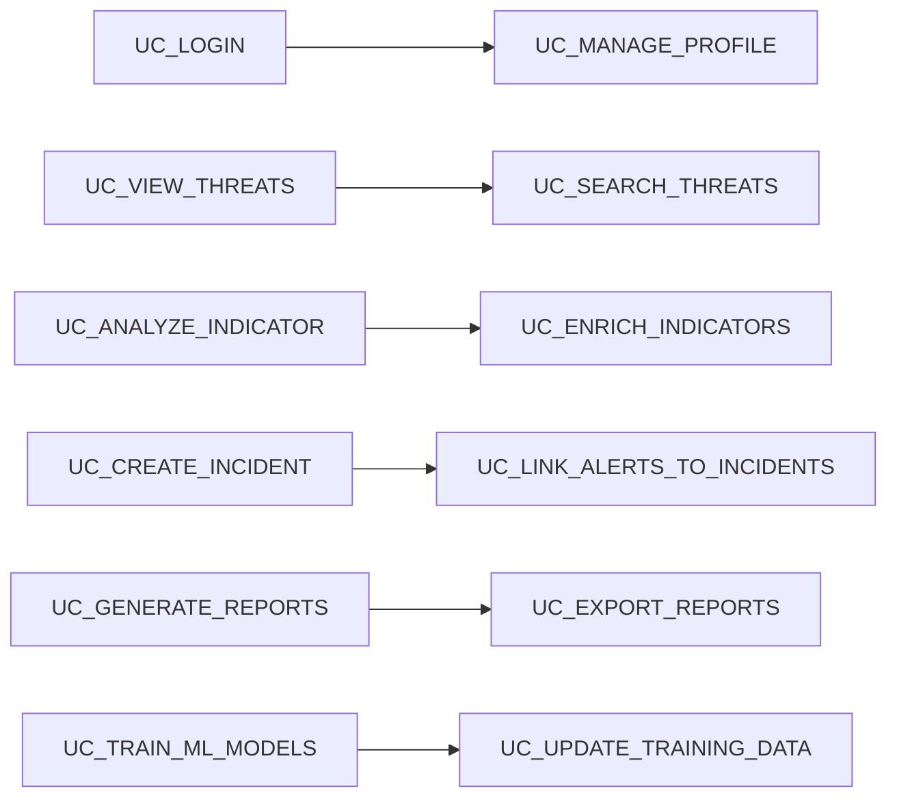
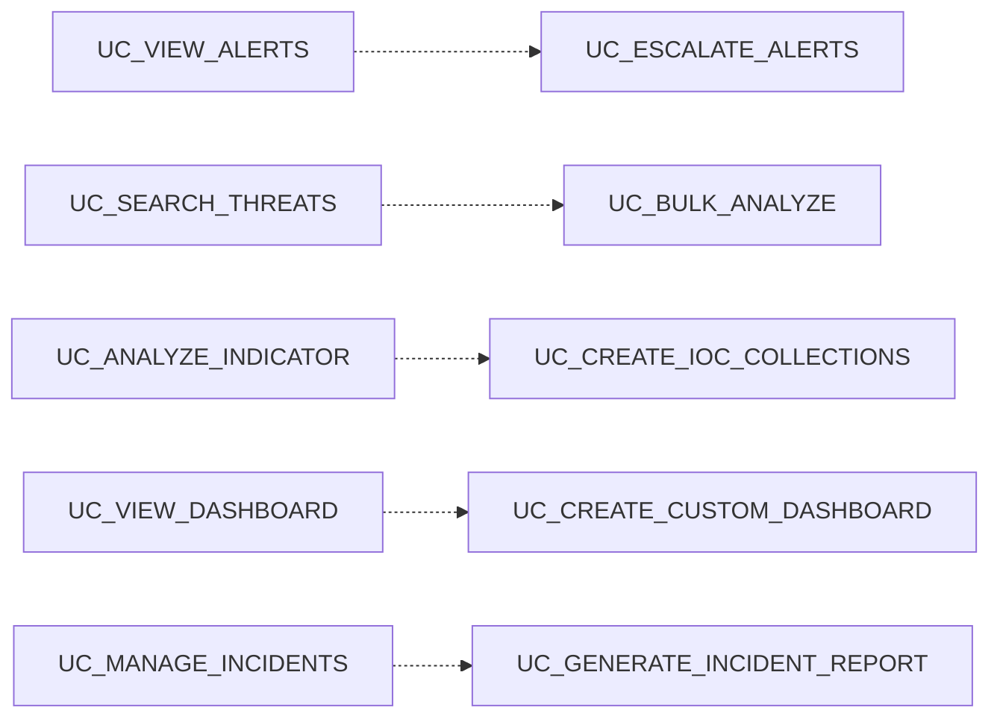
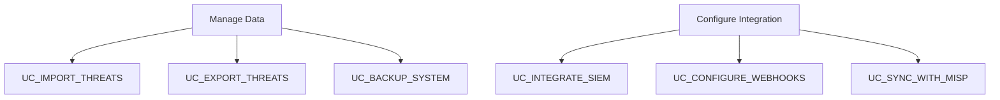

# 🎭 KRSN-RT2I Use Case Diagram

## 📋 Complete System Use Cases

This use case diagram represents all functional requirements and user interactions for the KRSN-RT2I threat intelligence platform, covering all actor types and system capabilities.

## 🎯 System Actors & Use Cases

```mermaid
graph TB
    %% Actor Definitions
    subgraph "👥 Primary Actors"
        SOC_ANALYST[🔍 SOC Analyst]
        SECURITY_MANAGER[👔 Security Manager]
        SYSTEM_ADMIN[⚙️ System Administrator]
        IT_ADMIN[💻 IT Administrator]
        THREAT_HUNTER[🕵️ Threat Hunter]
        SECURITY_RESEARCHER[📚 Security Researcher]
        API_USER[🔌 API User]
        GUEST_USER[👤 Guest User]
    end
    
    subgraph "🤖 Secondary Actors"
        EXTERNAL_FEEDS[📡 Threat Intelligence Feeds]
        SIEM_SYSTEMS[🖥️ SIEM Systems]
        EMAIL_SERVER[📧 Email Server]
        WEBHOOK_SERVICES[🔗 Webhook Services]
        ML_SERVICES[🧠 ML Services]
        ENRICHMENT_APIS[🔍 Enrichment APIs]
    end
    
    %% Core System
    subgraph "🛡️ KRSN-RT2I Platform"
        
        %% Authentication & User Management
        subgraph "🔐 Authentication & User Management"
            UC_LOGIN[Login to System]
            UC_LOGOUT[Logout from System]
            UC_REGISTER[Register New User]
            UC_MANAGE_PROFILE[Manage User Profile]
            UC_RESET_PASSWORD[Reset Password]
            UC_MANAGE_API_KEYS[Manage API Keys]
            UC_VIEW_AUDIT_LOGS[View Audit Logs]
        end
        
        %% Threat Intelligence Management
        subgraph "🛡️ Threat Intelligence Management"
            UC_VIEW_THREATS[View Threat Indicators]
            UC_SEARCH_THREATS[Search Threat Data]
            UC_ANALYZE_INDICATOR[Analyze Single Indicator]
            UC_BULK_ANALYZE[Bulk Analyze Indicators]
            UC_CORRELATE_THREATS[Correlate Threat Indicators]
            UC_ENRICH_INDICATORS[Enrich Threat Indicators]
            UC_EXPORT_THREATS[Export Threat Data]
            UC_IMPORT_THREATS[Import Threat Data]
            UC_MANAGE_WATCHLISTS[Manage Watchlists]
            UC_TAG_THREATS[Tag Threat Indicators]
        end
        
        %% Feed Management
        subgraph "📡 Feed Management"
            UC_CONFIGURE_FEEDS[Configure Threat Feeds]
            UC_MONITOR_FEEDS[Monitor Feed Status]
            UC_REFRESH_FEEDS[Manually Refresh Feeds]
            UC_VALIDATE_FEEDS[Validate Feed Data]
            UC_SCHEDULE_FEEDS[Schedule Feed Updates]
            UC_MANAGE_SOURCES[Manage Threat Sources]
        end
        
        %% Alert Management
        subgraph "🚨 Alert Management"
            UC_VIEW_ALERTS[View Active Alerts]
            UC_CREATE_ALERT_RULES[Create Alert Rules]
            UC_MANAGE_ALERT_RULES[Manage Alert Rules]
            UC_ACKNOWLEDGE_ALERTS[Acknowledge Alerts]
            UC_RESOLVE_ALERTS[Resolve Alerts]
            UC_ESCALATE_ALERTS[Escalate Alerts]
            UC_CONFIGURE_NOTIFICATIONS[Configure Notifications]
            UC_VIEW_ALERT_HISTORY[View Alert History]
        end
        
        %% Incident Management
        subgraph "🔍 Incident Management"
            UC_CREATE_INCIDENT[Create Security Incident]
            UC_MANAGE_INCIDENTS[Manage Incidents]
            UC_ASSIGN_INCIDENTS[Assign Incidents]
            UC_UPDATE_INCIDENT_STATUS[Update Incident Status]
            UC_LINK_ALERTS_TO_INCIDENTS[Link Alerts to Incidents]
            UC_DOCUMENT_INCIDENT[Document Incident Response]
            UC_CLOSE_INCIDENT[Close Incident]
            UC_GENERATE_INCIDENT_REPORT[Generate Incident Report]
        end
        
        %% Threat Hunting
        subgraph "🕵️ Threat Hunting"
            UC_CREATE_HUNT_SESSION[Create Hunt Session]
            UC_EXECUTE_HUNT_QUERIES[Execute Hunt Queries]
            UC_ANALYZE_HUNT_RESULTS[Analyze Hunt Results]
            UC_SAVE_HUNT_QUERIES[Save Hunt Queries]
            UC_SHARE_HUNT_RESULTS[Share Hunt Results]
            UC_CREATE_IOC_COLLECTIONS[Create IOC Collections]
            UC_MANAGE_HUNT_PLAYBOOKS[Manage Hunt Playbooks]
        end
        
        %% Machine Learning & Analytics
        subgraph "🧠 Machine Learning & Analytics"
            UC_TRAIN_ML_MODELS[Train ML Models]
            UC_DEPLOY_ML_MODELS[Deploy ML Models]
            UC_VIEW_ML_PREDICTIONS[View ML Predictions]
            UC_VALIDATE_PREDICTIONS[Validate ML Predictions]
            UC_TUNE_ML_PARAMETERS[Tune ML Parameters]
            UC_ANALYZE_MODEL_PERFORMANCE[Analyze Model Performance]
            UC_UPDATE_TRAINING_DATA[Update Training Data]
        end
        
        %% Reporting & Visualization
        subgraph "📊 Reporting & Visualization"
            UC_VIEW_DASHBOARD[View Main Dashboard]
            UC_CREATE_CUSTOM_DASHBOARD[Create Custom Dashboard]
            UC_CONFIGURE_WIDGETS[Configure Dashboard Widgets]
            UC_GENERATE_REPORTS[Generate Threat Reports]
            UC_SCHEDULE_REPORTS[Schedule Automated Reports]
            UC_EXPORT_REPORTS[Export Reports]
            UC_VIEW_STATISTICS[View System Statistics]
            UC_ANALYZE_TRENDS[Analyze Threat Trends]
        end
        
        %% System Administration
        subgraph "⚙️ System Administration"
            UC_MANAGE_USERS[Manage Users]
            UC_CONFIGURE_SYSTEM[Configure System Settings]
            UC_MONITOR_SYSTEM_HEALTH[Monitor System Health]
            UC_MANAGE_INTEGRATIONS[Manage External Integrations]
            UC_BACKUP_SYSTEM[Backup System Data]
            UC_RESTORE_SYSTEM[Restore System Data]
            UC_UPDATE_SYSTEM[Update System]
            UC_MANAGE_LICENSES[Manage Licenses]
        end
        
        %% API & Integration
        subgraph "🔌 API & Integration"
            UC_ACCESS_REST_API[Access REST API]
            UC_STREAM_REAL_TIME_DATA[Stream Real-time Data]
            UC_CONFIGURE_WEBHOOKS[Configure Webhooks]
            UC_INTEGRATE_SIEM[Integrate with SIEM]
            UC_EXPORT_STIX[Export STIX/TAXII Data]
            UC_IMPORT_STIX[Import STIX/TAXII Data]
            UC_SYNC_WITH_MISP[Sync with MISP]
        end
        
        %% Compliance & Audit
        subgraph "📋 Compliance & Audit"
            UC_GENERATE_COMPLIANCE_REPORTS[Generate Compliance Reports]
            UC_AUDIT_USER_ACTIVITIES[Audit User Activities]
            UC_MANAGE_DATA_RETENTION[Manage Data Retention]
            UC_ENSURE_DATA_PRIVACY[Ensure Data Privacy]
            UC_TRACK_DATA_LINEAGE[Track Data Lineage]
        end
    end
    
    %% Actor-Use Case Relationships
    
    %% SOC Analyst Relationships
    SOC_ANALYST --> UC_LOGIN
    SOC_ANALYST --> UC_VIEW_THREATS
    SOC_ANALYST --> UC_SEARCH_THREATS
    SOC_ANALYST --> UC_ANALYZE_INDICATOR
    SOC_ANALYST --> UC_BULK_ANALYZE
    SOC_ANALYST --> UC_VIEW_ALERTS
    SOC_ANALYST --> UC_ACKNOWLEDGE_ALERTS
    SOC_ANALYST --> UC_RESOLVE_ALERTS
    SOC_ANALYST --> UC_CREATE_INCIDENT
    SOC_ANALYST --> UC_MANAGE_INCIDENTS
    SOC_ANALYST --> UC_VIEW_DASHBOARD
    SOC_ANALYST --> UC_EXPORT_THREATS
    SOC_ANALYST --> UC_TAG_THREATS
    SOC_ANALYST --> UC_CORRELATE_THREATS
    
    %% Security Manager Relationships
    SECURITY_MANAGER --> UC_LOGIN
    SECURITY_MANAGER --> UC_VIEW_DASHBOARD
    SECURITY_MANAGER --> UC_GENERATE_REPORTS
    SECURITY_MANAGER --> UC_SCHEDULE_REPORTS
    SECURITY_MANAGER --> UC_VIEW_STATISTICS
    SECURITY_MANAGER --> UC_ANALYZE_TRENDS
    SECURITY_MANAGER --> UC_MANAGE_ALERT_RULES
    SECURITY_MANAGER --> UC_ESCALATE_ALERTS
    SECURITY_MANAGER --> UC_ASSIGN_INCIDENTS
    SECURITY_MANAGER --> UC_GENERATE_COMPLIANCE_REPORTS
    SECURITY_MANAGER --> UC_CREATE_CUSTOM_DASHBOARD
    
    %% System Administrator Relationships
    SYSTEM_ADMIN --> UC_LOGIN
    SYSTEM_ADMIN --> UC_MANAGE_USERS
    SYSTEM_ADMIN --> UC_CONFIGURE_SYSTEM
    SYSTEM_ADMIN --> UC_MONITOR_SYSTEM_HEALTH
    SYSTEM_ADMIN --> UC_BACKUP_SYSTEM
    SYSTEM_ADMIN --> UC_RESTORE_SYSTEM
    SYSTEM_ADMIN --> UC_UPDATE_SYSTEM
    SYSTEM_ADMIN --> UC_MANAGE_LICENSES
    SYSTEM_ADMIN --> UC_VIEW_AUDIT_LOGS
    SYSTEM_ADMIN --> UC_CONFIGURE_FEEDS
    SYSTEM_ADMIN --> UC_MANAGE_INTEGRATIONS
    
    %% IT Administrator Relationships
    IT_ADMIN --> UC_LOGIN
    IT_ADMIN --> UC_CONFIGURE_FEEDS
    IT_ADMIN --> UC_MONITOR_FEEDS
    IT_ADMIN --> UC_MANAGE_SOURCES
    IT_ADMIN --> UC_CONFIGURE_NOTIFICATIONS
    IT_ADMIN --> UC_INTEGRATE_SIEM
    IT_ADMIN --> UC_CONFIGURE_WEBHOOKS
    IT_ADMIN --> UC_MANAGE_API_KEYS
    IT_ADMIN --> UC_SYNC_WITH_MISP
    
    %% Threat Hunter Relationships
    THREAT_HUNTER --> UC_LOGIN
    THREAT_HUNTER --> UC_CREATE_HUNT_SESSION
    THREAT_HUNTER --> UC_EXECUTE_HUNT_QUERIES
    THREAT_HUNTER --> UC_ANALYZE_HUNT_RESULTS
    THREAT_HUNTER --> UC_SAVE_HUNT_QUERIES
    THREAT_HUNTER --> UC_CREATE_IOC_COLLECTIONS
    THREAT_HUNTER --> UC_MANAGE_HUNT_PLAYBOOKS
    THREAT_HUNTER --> UC_CORRELATE_THREATS
    THREAT_HUNTER --> UC_ENRICH_INDICATORS
    THREAT_HUNTER --> UC_SHARE_HUNT_RESULTS
    
    %% Security Researcher Relationships
    SECURITY_RESEARCHER --> UC_LOGIN
    SECURITY_RESEARCHER --> UC_TRAIN_ML_MODELS
    SECURITY_RESEARCHER --> UC_DEPLOY_ML_MODELS
    SECURITY_RESEARCHER --> UC_VIEW_ML_PREDICTIONS
    SECURITY_RESEARCHER --> UC_VALIDATE_PREDICTIONS
    SECURITY_RESEARCHER --> UC_TUNE_ML_PARAMETERS
    SECURITY_RESEARCHER --> UC_ANALYZE_MODEL_PERFORMANCE
    SECURITY_RESEARCHER --> UC_UPDATE_TRAINING_DATA
    SECURITY_RESEARCHER --> UC_ANALYZE_TRENDS
    SECURITY_RESEARCHER --> UC_EXPORT_THREATS
    
    %% API User Relationships
    API_USER --> UC_ACCESS_REST_API
    API_USER --> UC_STREAM_REAL_TIME_DATA
    API_USER --> UC_BULK_ANALYZE
    API_USER --> UC_EXPORT_STIX
    API_USER --> UC_IMPORT_STIX
    API_USER --> UC_SEARCH_THREATS
    
    %% Guest User Relationships
    GUEST_USER --> UC_VIEW_DASHBOARD
    GUEST_USER --> UC_VIEW_STATISTICS
    GUEST_USER --> UC_REGISTER
    
    %% External System Relationships
    EXTERNAL_FEEDS --> UC_REFRESH_FEEDS
    EXTERNAL_FEEDS --> UC_VALIDATE_FEEDS
    SIEM_SYSTEMS --> UC_INTEGRATE_SIEM
    EMAIL_SERVER --> UC_CONFIGURE_NOTIFICATIONS
    WEBHOOK_SERVICES --> UC_CONFIGURE_WEBHOOKS
    ML_SERVICES --> UC_TRAIN_ML_MODELS
    ENRICHMENT_APIS --> UC_ENRICH_INDICATORS
```

## 🎭 Actor Descriptions

### **👥 Primary Actors**

#### **🔍 SOC Analyst**
**Role**: Front-line security analyst monitoring and responding to threats
**Responsibilities**:
- Monitor incoming threat alerts
- Investigate suspicious indicators
- Correlate threat intelligence
- Create and manage security incidents
- Perform initial threat analysis

**Key Use Cases**:
- View and search threat indicators
- Acknowledge and resolve alerts
- Create security incidents
- Export threat data for analysis

#### **👔 Security Manager**
**Role**: Strategic oversight of security operations and reporting
**Responsibilities**:
- Review security metrics and trends
- Generate executive reports
- Manage alert escalation policies
- Oversee incident response coordination
- Make strategic security decisions

**Key Use Cases**:
- View executive dashboards
- Generate compliance reports
- Manage alert rules and escalation
- Analyze threat trends and statistics

#### **⚙️ System Administrator**
**Role**: Technical administration of the KRSN-RT2I platform
**Responsibilities**:
- User account management
- System configuration and maintenance
- Performance monitoring
- Backup and recovery operations
- License and update management

**Key Use Cases**:
- Manage users and permissions
- Configure system settings
- Monitor system health
- Perform backup/restore operations

#### **💻 IT Administrator**
**Role**: Integration and feed management specialist
**Responsibilities**:
- Configure threat intelligence feeds
- Manage external integrations
- API key and webhook management
- SIEM integration setup
- Data source validation

**Key Use Cases**:
- Configure and monitor threat feeds
- Set up external integrations
- Manage API access and webhooks
- Validate feed data quality

#### **🕵️ Threat Hunter**
**Role**: Proactive threat detection and hunting specialist
**Responsibilities**:
- Conduct proactive threat hunting
- Develop hunting queries and playbooks
- Create IOC collections
- Advanced threat correlation
- Share hunting intelligence

**Key Use Cases**:
- Create and execute hunt sessions
- Develop hunt queries and playbooks
- Build IOC collections
- Perform advanced threat correlation

#### **📚 Security Researcher**
**Role**: Machine learning and advanced analytics specialist
**Responsibilities**:
- Develop and train ML models
- Validate prediction accuracy
- Tune algorithm parameters
- Research threat patterns
- Improve detection capabilities

**Key Use Cases**:
- Train and deploy ML models
- Validate ML predictions
- Analyze model performance
- Update training datasets

#### **🔌 API User**
**Role**: External systems and automated integrations
**Responsibilities**:
- Automated threat intelligence queries
- Real-time data streaming
- STIX/TAXII data exchange
- Programmatic access to platform features

**Key Use Cases**:
- Access REST APIs
- Stream real-time threat data
- Import/export STIX data
- Bulk analyze indicators

#### **👤 Guest User**
**Role**: Limited access visitor or evaluator
**Responsibilities**:
- View public dashboards
- Access general statistics
- Register for platform access

**Key Use Cases**:
- View limited dashboard data
- Access public threat statistics
- Register for full platform access

### **🤖 Secondary Actors**

#### **📡 Threat Intelligence Feeds**
External threat intelligence providers (AbuseIPDB, VirusTotal, CVE, CISA)

#### **🖥️ SIEM Systems**
Security Information and Event Management platforms

#### **📧 Email Server**
Email notification delivery system

#### **🔗 Webhook Services**
External services receiving webhook notifications

#### **🧠 ML Services**
Machine learning processing services

#### **🔍 Enrichment APIs**
Additional context data providers

## 🔄 Use Case Relationships

### **Include Relationships**

### **Extend Relationships**

### **Generalization Relationships**

## 📊 Use Case Complexity Analysis

### **🔴 High Complexity Use Cases**
| Use Case | Complexity | Reason |
|----------|------------|---------|
| `UC_CORRELATE_THREATS` | High | Complex ML algorithms and graph analysis |
| `UC_TRAIN_ML_MODELS` | High | Machine learning pipeline management |
| `UC_BULK_ANALYZE` | High | Large-scale data processing |
| `UC_INTEGRATE_SIEM` | High | Complex external system integration |
| `UC_EXECUTE_HUNT_QUERIES` | High | Advanced query processing and analysis |

### **🟡 Medium Complexity Use Cases**
| Use Case | Complexity | Reason |
|----------|------------|---------|
| `UC_MANAGE_INCIDENTS` | Medium | Workflow management and state tracking |
| `UC_CONFIGURE_FEEDS` | Medium | Multi-source data integration |
| `UC_GENERATE_REPORTS` | Medium | Complex data aggregation and formatting |
| `UC_ENRICH_INDICATORS` | Medium | Multiple API integrations |
| `UC_CREATE_ALERT_RULES` | Medium | Rule engine and condition processing |

### **🟢 Low Complexity Use Cases**
| Use Case | Complexity | Reason |
|----------|------------|---------|
| `UC_VIEW_DASHBOARD` | Low | Data display and visualization |
| `UC_LOGIN` | Low | Standard authentication |
| `UC_VIEW_ALERTS` | Low | Simple data retrieval |
| `UC_TAG_THREATS` | Low | Basic data manipulation |
| `UC_EXPORT_REPORTS` | Low | Standard file operations |

## 🎯 Business Value Analysis

### **💰 High Business Value**
- `UC_VIEW_THREATS` - Core threat visibility
- `UC_CORRELATE_THREATS` - Advanced threat detection
- `UC_MANAGE_INCIDENTS` - Incident response efficiency
- `UC_GENERATE_REPORTS` - Executive reporting and compliance
- `UC_TRAIN_ML_MODELS` - Continuous improvement capability

### **📈 Medium Business Value**
- `UC_CREATE_HUNT_SESSION` - Proactive threat hunting
- `UC_CONFIGURE_FEEDS` - Data source management
- `UC_INTEGRATE_SIEM` - Enterprise integration
- `UC_MANAGE_USERS` - Operational efficiency
- `UC_VIEW_STATISTICS` - Operational insights

### **🔧 Operational Value**
- `UC_BACKUP_SYSTEM` - Data protection
- `UC_MONITOR_SYSTEM_HEALTH` - System reliability
- `UC_MANAGE_API_KEYS` - Security management
- `UC_VIEW_AUDIT_LOGS` - Compliance and security
- `UC_UPDATE_SYSTEM` - Platform maintenance

## 🏆 Academic Value for University Project

### **🎓 Software Engineering Excellence**
- **Complete functional requirements** captured in use cases
- **Actor-system interaction modeling** for requirements analysis
- **Complexity analysis** for project planning and estimation
- **Traceability matrix** from requirements to implementation

### **🔬 Research Components**
- **ML-driven use cases** demonstrating AI integration
- **Real-time processing** requirements for performance research
- **Security-focused** use cases for cybersecurity domain expertise
- **Scalability considerations** for distributed systems research

### **🏗️ System Architecture**
- **Multi-actor system** demonstrating complex stakeholder management
- **External system integration** showing enterprise architecture skills
- **Role-based access control** implementation
- **API-first design** principles

This comprehensive use case diagram provides the functional foundation for your KRSN-RT2I project, demonstrating the full scope of system capabilities while supporting both practical implementation and academic evaluation requirements.
